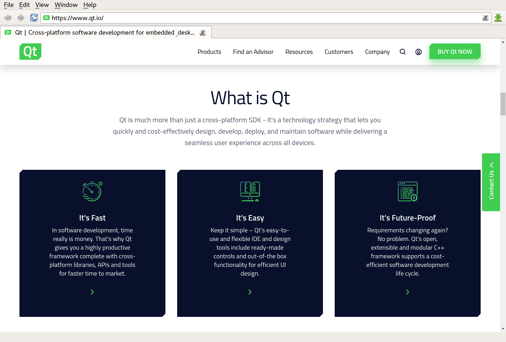

*"The only way to do great work is to love what you do."* – Steve Jobs

&nbsp; &nbsp; &nbsp; &nbsp;After decent weeks worth of work in software engineering, the dedication to craft certain skills has become keen to me. With each new skill comes challenges, but obtained afterwards is a tool that you can use forever. The prior week emphasized HTML and CSS. These tools allow developers to handle everything from layout design to responsiveness of web pages manually. During the weekly practice sessions, we had to create a web page on browser histories from scratch. Now we are using a UI framework called Bootstrap 5.

&nbsp; &nbsp; &nbsp; &nbsp;Bootstrap 5 comes with its own library of functions and icons that are readily accessible. It’s another language to learn new mini tools to use in web development. There’s other UI frameworks, but I haven’t had the opportunity to utilize them. When I think about the difficulty between using HTML or Bootstrap, I compare it to another language set known as C and C++. They are both separate languages yet similarly used for the same purpose. HTML and Bootstrap also follow this.

---

## Experience between languages

&nbsp; &nbsp; &nbsp; &nbsp;Comparing both language sets, one language (C and HTML) is old school in contrast to their  modern counterparts (C++ and Bootstrap).  How you code their respective projects is also similar. The older languages were built as the fundamental building blocks in their respective field requiring developers to manually input functions or incorporate CSS content. The newer languages are more versatile and have pre-built functions or layouts. However, these tools are based on their fundamentals, so it’s not easy to use right from the start.

&nbsp; &nbsp; &nbsp; &nbsp;This highlights why learning C or HTML first is key to understanding how to mold more complex code. Learning Bootstrap after HTML wasn’t the worst, unlike my first rodeo with C and C++. That experience was a major turning point in combining passion and work. Bootstrap 5 introduced a new layout on the navigation bar, rows, columns, and split background on websites. The split background can be seen in the picture below with a footer on the top separated from the body. Some other features include the columns with their own respective boxes of text and the individual wording in the footer. 

    

## Final Thoughts!

&nbsp; &nbsp; &nbsp; &nbsp;In summary, although the learning curve associated with UI frameworks like Bootstrap 5 may initially seem intimidating, the long-term benefits are significant. These frameworks facilitate rapid development and responsive design while promoting maintainability and coding consistency. Investing time and effort into mastering these tools positions developers to become more efficient and effective in their craft. Per the quote at the top, bringing passion into work is a must to learn, especially in new languages.
